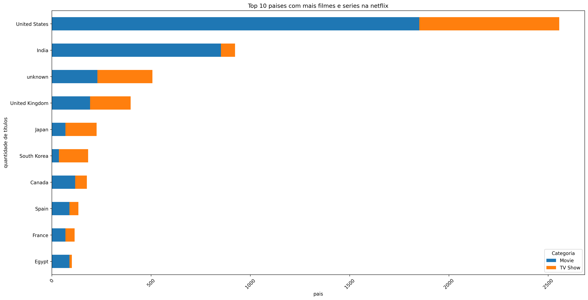
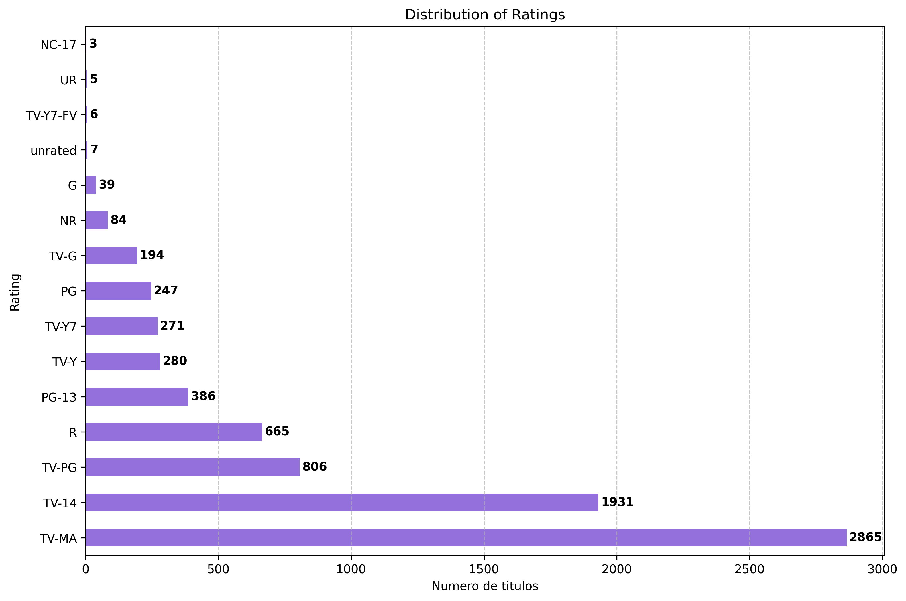

# 📊 Análise de Filmes e Séries da Netflix

Este projeto tem como objetivo explorar e visualizar padrões do catálogo da **Netflix** a partir de um dataset público obtido no site Kaggle.
(link para o dataset:https://www.kaggle.com/datasets/rohitgrewal/netflix-data?resource=download)
O foco é responder perguntas simples, mas relevantes, como:  
- Qual é a proporção de filmes vs séries?  
- Como está a distribuição por países?  
- Como variam as faixas etárias (ratings)?  
- Qual é a duração média dos filmes?  

---

 🔎 Visão Geral: Filmes vs Séries
1-[Overview Filmes vs Séries](Overview/outputs/figures/overview_filmes_vs_series.png)

O catálogo é majoritariamente composto por filmes,  contra .  
O catálogo da Netflix é majoritariamente composto por filmes, contendo 5379 títulos em comparação com as 2410 séries presentes no catálogo.
Isso não é coincidência: produzir filmes é mais barato, rápido e com menor risco do que bancar uma série inteira.

Um filme mediano já entrega liquidez imediata (atrai público por alguns dias e se paga rápido).

Já as séries, apesar de mais caras, funcionam como estratégia de retenção: mantêm assinantes engajados ao longo de semanas ou meses.
---

## 🌍 Distribuição por País

Não é nenhuma surpresa que os Estados Unidos dominem em número de títulos na Netflix — afinal, Hollywood é uma máquina de exportar conteúdo.

A parte realmente interessante aparece em outros mercados:

Coreia do Sul: séries esmagam os filmes. A onda dos doramas foi a porta do mercado cultural oriental, especialmente para a Coreia do Sul

Japão: segue a mesma lógica da Coreia, mas puxado pelo anime e dramas seriados que encontram público global.

Egito: aqui acontece o oposto, predominam filmes, produções locais que compõem o catálogo regional.

Índia: pega essa lógica do Egito e escala para outro nível. O país é uma verdadeira fábrica de filmes, usados pela Netflix para capturar mercado emergente

---

## 🎬 Distribuição de Duração dos Filmes

Esse gráfico traz a distribuição das durações
Os filmes da Netflix seguem o padrão clássico de duração, produzindo em escala industrial.

Mantendo o formato padrão de longa-metragem, a empresa consegue soltar novos títulos praticamente toda semana.

## 🔞 Distribuição das Faixas Etárias

 
- A Netflix tem forte foco em conteúdos para maiores de 13 e 16 anos.  
- O catálogo infantil existe, mas é minoritário.  
- Isso reflete a estratégia de manter o público jovem-adulto como principal consumidor.

---
Os resultados mostram que a Netflix equilibra estratégias distintas: filmes como commodity de engajamento rápido, séries como ferramenta de retenção, e um portfólio regional adaptado a mercados estratégicos como Índia e Coreia do Sul. Essa abordagem revela muito sobre como a plataforma opera como empresa global de mídia.
Os resultados mostram que a Netflix equilibra estratégias distintas: filmes como commodity de engajamento rápido, séries como ferramenta de retenção, e um portfólio regional adaptado a mercados estratégicos como Índia e Coreia do Sul. Essa abordagem revela muito sobre como a plataforma opera como empresa global de mídia.
